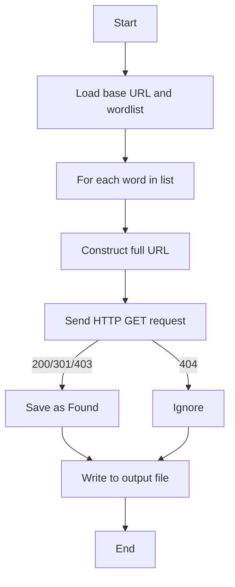

### Example use

```bash
echo -e "admin\nuploads\nbackup\napi\nconfig.php" > dirs.txt
python3 dir_bruteforce.py --url https://example.com/ --wordlist dirs.txt --threads 20
```

**Sample Output:**

```
[FOUND] https://example.com/admin/  (Status: 301, Size: 169 bytes)
[FOUND] https://example.com/uploads/  (Status: 200, Size: 3421 bytes)
[+] Found 2 accessible directories/files.
```

---

## ⚙️ Algorithm




