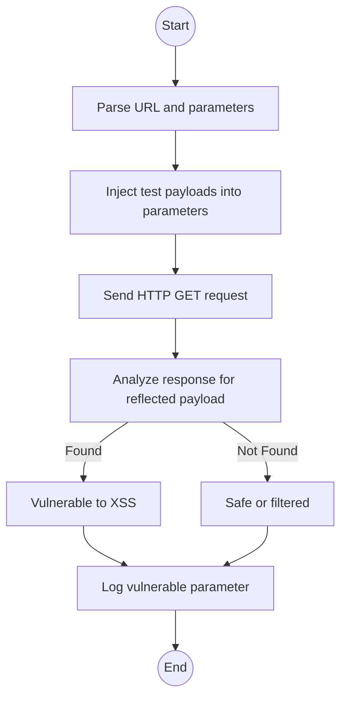

An **XSS Finder** works by:

1. Crawling or testing URLs with parameters (e.g., `?q=value`).
2. Injecting special payloads like `"<script>alert('XSS')</script>"`.
3. Analyzing the HTTP response to see if the payload appears unencoded.
4. Reporting possible vulnerabilities.

---


### Dependencies

```bash
sudo apt install python3
pip install requests beautifulsoup4 colorama
```


### Example Usage

```bash
python3 xss_finder.py --url "https://example.com/search?q=hello"
```

**Sample Output:**

```
[+] Testing 1 parameters for XSS...
[VULNERABLE] q reflected with payload: <script>alert('XSS')</script>
```

---

## Algorithm




---

## ⚔️ How to Use on Kali Linux

## Python

```bash
python3 xss_finder.py --url "https://testphp.vulnweb.com/search.php?search=test"
```

## C

```bash
gcc xss_finder.c -o xss_finder -lcurl
./xss_finder "https://testphp.vulnweb.com/search.php?search="
```


